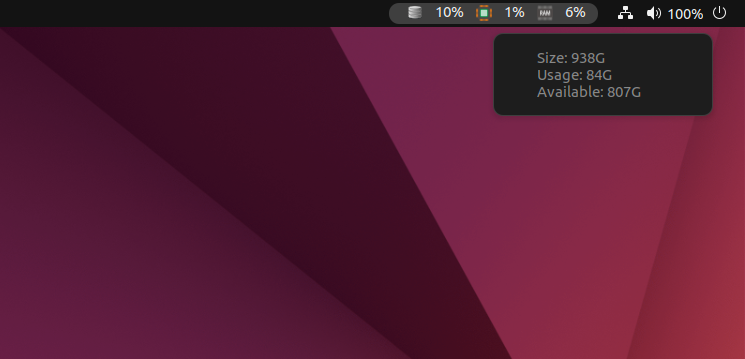

<h1 align="center">System Utilities</h1>

<p>Gnome extension to help with system management and monitoring with docker.</p>

<ul>
 <li>[ OK ] Show current disk usage on top panel.</li>
 <li>[ OK ] Show current CPU usage on top panel.</li>
 <li>[ OK ] Show current memory usage on top panel.</li>
 <li>[    ] Manager docker containers.</li>
</ul>

<h1 align="center">Screenshot</h1>

<p align="center">
  
</p>

<h3>View logs: </h4>

```bash
journalctl -f -o cat /usr/bin/gnome-shell
```
